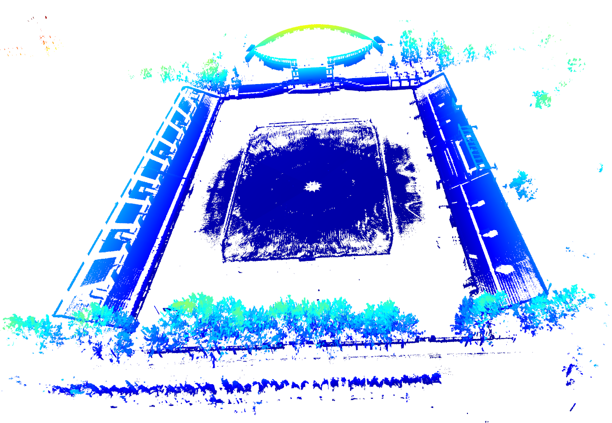
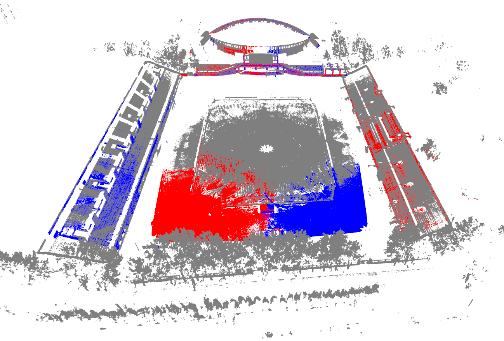
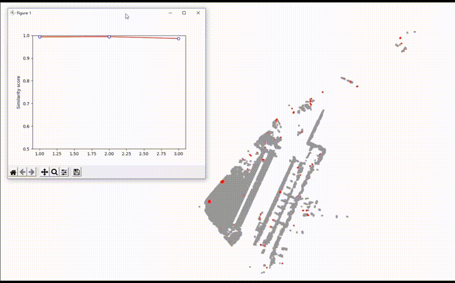
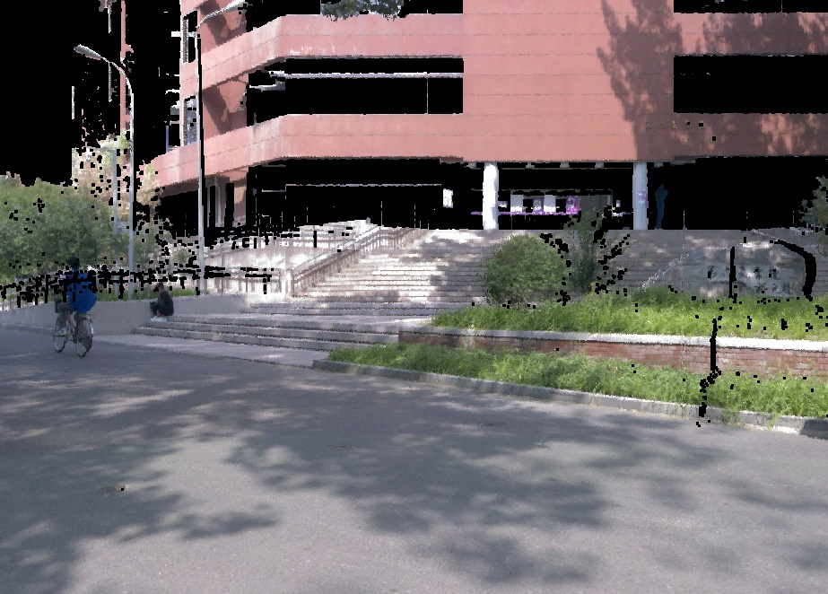

# PointCloudTools
Some useful tools to processing point cloud data

## Registration
- We refer to the global registration [code](http://www.open3d.org/docs/release/tutorial/pipelines/global_registration.html) from open3d tutorial
- This is a coarse-to-fine algorithm that register two point clouds without initial alignment.
- With this registration algorithm, we reconstruct **East playground** of Tsinghua University using four LIDAR (left image) and localize another two LIDAR in this scene (right image).

## Temporal Synchronization
- When multiple lidars are used indoors to collect scene point cloud data, they need to be synchronized temporally.
- We use the **chamfer distance** to measure the similarity of two point clouds. 
- Fix the point cloud from one lidar and play the point cloud of another lidar. As shown in the gif below, when the chamfering distance reaches the minimum, it means that the two point clouds are synchronized temporally.

## Move Detect
- We used lidar to collect point cloud data for about 60 seconds at the entrance of the Tsinghua **Central Main Building**, where the lidar was moved three times. 
- We divide the data into several sub-point clouds at an interval of 20 frames. 
- We detect the moving points (red points in the figure) between two adjacent sub-point clouds, and calculate the similarity score.

## Pointcloud to Image
- This helps to generate an image from a point cloud with a specific perspective.
- The principle of this algorithm is to project the color points onto an imaging plane perpendicular to the x axis.
- And can mask out the pixels that are not projected on the image.

## Virtual Camera
- It's a fantastic tool if you want to generate a demo vedio from a specific point cloud, this makes you like traveling through it!
- We offer two modes in `visualization/virtual_camera.py`. 
    - One is to generate a line trajectory from one point to another point. You can also select a series of point manually and set the speed of transformation.
    

    
    

    - Another is ti generate a circular trajectory with a point as the center. You can select the center point manually and set the speed of transformation.
    

    
    
