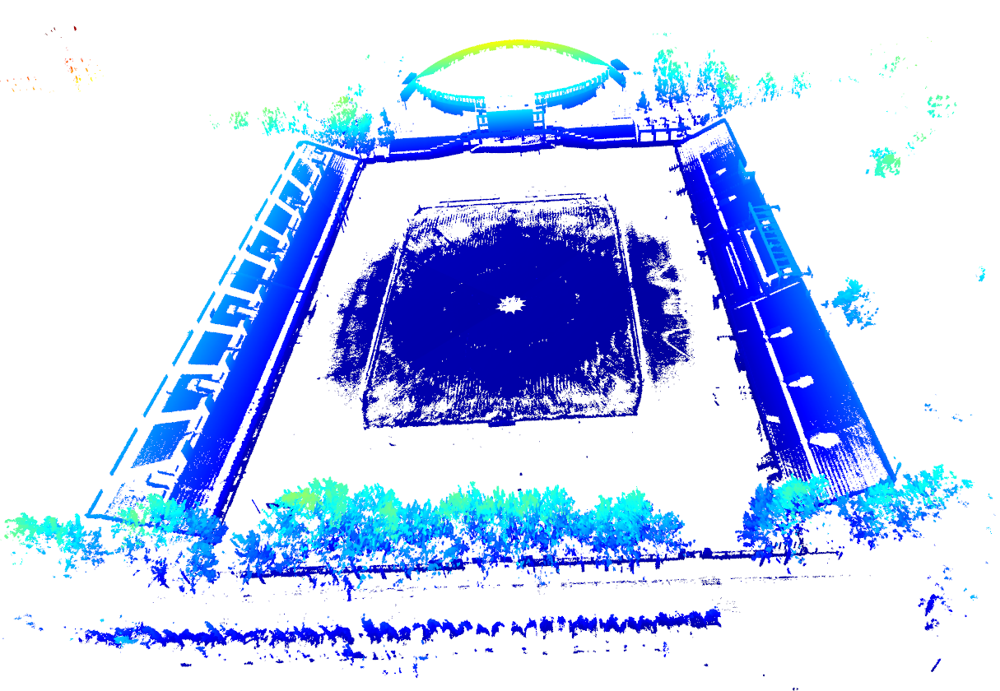
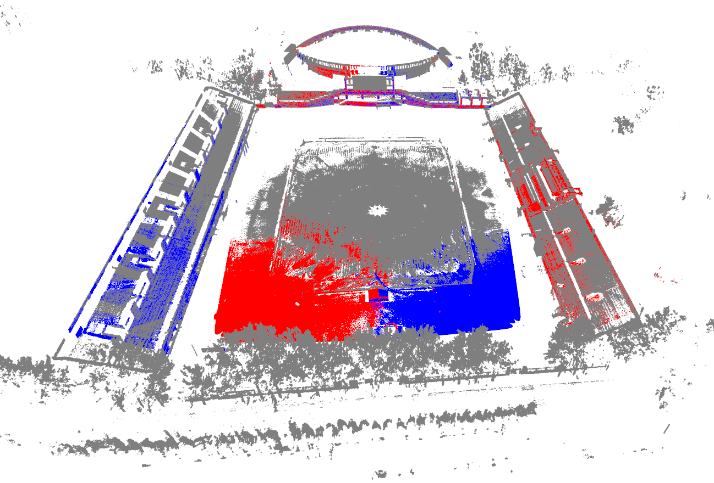

# PointCloudTools-Demo

## Registration
- We refer to the global registration [code](http://www.open3d.org/docs/release/tutorial/pipelines/global_registration.html) from open3d tutorial
- This is a coarse-to-fine algorithm that register two point clouds without initial alignment.
- With this registration algorithm, we reconstruct **East playground** of Tsinghua University using four LIDAR (left image) and localize another two LIDAR in this scene (right image).

## Move Detect
- We used lidar to collect point cloud data for about 60 seconds at the entrance of the Tsinghua **Central Main Building**, where the lidar was moved three times. 
- We divide the data into several sub-point clouds at an interval of 20 frames. 
- We detect the moving points (red points in the figure) between two adjacent sub-point clouds, and calculate the similarity score.

